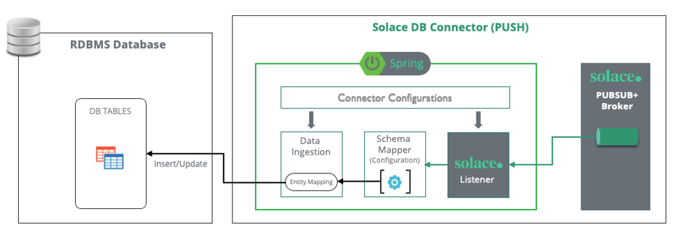

#Solace Pubsub Connector For Database Sink 


 
## 1	Introduction

The **Solace Pubsub Connector For Database Sink** has been built to make DB transactions participated in event mesh by using the Connectors.

**Solace Pubsub Connector For Database Sink** helps to consume events from Solace Broker or Event Mesh, transform the payload and insert into  the database table as records. 

**Solace Pubsub Connector For Database Sink** consumes the events from Solace and insert into DB as a record.
 


### 1.1 Purpose

To guide the technical teams to setup the Solace Pubsub Connector For Database Sink.
### 1.2 Scope

Covering the step-by-step guide to setup the Solace Pubsub Connector For Database Sink.

1.	Generate JPA Entities using the tool

2.	Configure DB Sink Connector

	a.	Connection Configuration (Database & Solace)
	
	b.	Connector & Entity Configuration
	
	c.	Schema Mapping (Solace Event Payload to Table Structure)
3.	Configure DB Sink Connector

	a. Connection Configuration (Database & Solace)

	b.	Connector & Entity Configuration

	c.	Schema Mapping (Solace Event Payload to Table Structure)

`Note: This document currently captures the standalone deployment in Java environment.`

### 1.3 DB Connector Features

| S.No |	Feature |
| :---: | ---- |
| 1 |	The source DB object from where Adapter polls remains as-is (as EMS). No change expected at application DB end (Includes Tables, Views & Child Table)|
|2	 | Adapter should consume events from Solace and insert records into table in sequence.|
| 3 |	The adapter should have the capability to consume in batch and update insert DB in batch to avoid chattiness and ensure better performance |
| 4 | Oracle DB should be supported (12g onwards (19C and ADG and RAC) |
|5	 | Design should be future proof for oracle version upgrades. Should support Thick and Thin DB driver|
|6	|Should support ADG URL|
|7|	Schema mapping feature should be Forward compatible. |
|8	|Any new addition to DB schema should be ignored by Adapter unless Field name and mapping is provided.|
|9|	Option to specify the data type of each field in the mapping.|
|10	|Support for CLOB and BLOB|
|11	|Date format to be as per the TIBCO specs - Should be configurable. default is yyyy-MM-dd'T'HH:mm:ss.SSS  |
|12	|Logging & Syslog|
|13	|High Available & Fault Tolerance|
|14	| Event Headers:  <br/>  &emsp;&emsp;  In Solace Message Header, for each message published, add Tracking Id coming from source table <br/>&emsp;&emsp;  Time at which picked from DB <br/> &emsp;&emsp;  Time of publish to Solace |


## 2 Connector Configuration
### 2.1	Pre-requisites

*	JDK 1.8+
*	Solace 
*	Database for Oracle or MySQL

### 2.2	Install Solace Framework and Transform Engine

Go to the Framework jar and pom files folder and run below command to install into your local maven repo:

```
mvn install:install-file -Dfile=pubsubplus-connector-framework-parent-1.0.0-SNAPSHOT.pom -DgroupId=com.solace.connector.core -DartifactId=pubsubplus-connector-framework-parent  -Dversion=1.0.0-SNAPSHOT  -DpomFile=pubsubplus-connector-framework-parent-1.0.0-SNAPSHOT.pom

mvn install:install-file -Dfile=pubsubplus-connector-io-common-1.0.0-SNAPSHOT.jar -DgroupId=com.solace.connector.core -DartifactId=pubsubplus-connector-io-common -Dversion=1.0.0-SNAPSHOT -DpomFile=pubsubplus-connector-io-common-1.0.0-SNAPSHOT.pom

mvn install:install-file -Dfile=pubsubplus-connector-framework-1.0.0-SNAPSHOT.jar -DgroupId=com.solace.connector.core -DartifactId=pubsubplus-connector-framework -Dversion=1.0.0-SNAPSHOT -DpomFile=pubsubplus-connector-framework-1.0.0-SNAPSHOT.pom

mvn install:install-file -Dfile=solace-transformation-engine-1.0.3-SNAPSHOT.jar -DgroupId=com.solace.connector.core -DartifactId=solace-transformation-engine  -Dversion=1.0.3-SNAPSHOT -DpomFile=solace-transformation-engine-1.0.3-SNAPSHOT.pom
```


### 2.3	Solace Pubsub Connector For DB Sink install

Download the Solace Pubsub Connector For DB Sink(spring-cloud-stream-binder-db and pubsubplus-connector-database) and unzip to the location/machine where the connector is getting installed

Go to spring-cloud-stream-binder-db folder and run:

```
mvn -DskipTests=true install
```
Go to folder pubsubplus-connector-database and run:

```
mvn -DskipTests=true clean package 
```
### 2.4	DB Configuration


**Cofiguration File:** `projConfig/application.yml`              

```
solace-persistence:
  datasource:
    driver-class-name: oracle.jdbc.OracleDriver
    url: jdbc:oracle:thin:@//192.168.3.178:1524/ORCLCDB
    username: c##test
    password: test
    hikari:
      minimum-idle: 10
      maximum-pool-size: 20
      idle-timeout: 500000
      max-lifetime: 540000
      connection-timeout: 5000
  jpa:
    hibernate:
      ddl-auto: none
    show-sql: false
    properties:
      hibernate:
        jdbc:
          batch_size: 100
        order_updates: true
        order_inserts: true
        generate_statistics: false
    #    database: mysql
    database: oracle
  sink:
    jpaBatchMode: true #internal cache
    jpaBatchSize: 60   #internal cache size
    jpaMaxRetry: 2     #retry to insert.
    jpaRetryWaitMilliseconds: 3000
    redirectOnFailEnable: false #will redirect the failed message to another topic with a prefix.
    redirectPrefix: RD/
    payloadFormat: xml

```           

* Fill in all the required details of `solace-persistence.datasource` to establish a connection with Database.

* `solace-persistence.datasource` section, `batch_size` is the jdbc connection level batch size.
           

### 2.5	Solace Configuration

**Configuration File:** `projConfig/application.yml`

Solace binder and DB binder.

```
spring:
  cloud:
    stream:
      bindings:
        input-0:
          destination: customer 
          group: group
          binder: solace
          consumer:
	         #Concurrency can be used with a consumer group (non-exclusive queue) to process events in multiple threads
            batch-mode: true
            concurrency: 1
            max-attempts: 2
            back-off-initial-interval: 5000
            back-off-multiplier: 1
            default-retryable: true
            retryable-exceptions:
              org.springframework.orm.jpa.JpaSystemException: true
        output-0:
	       destination: jsonQ/lvq
	       binder: solace-db        #solaceDB binder for Connector
	  solace:
	    bindings:
	      input-0:
	        consumer:
	          batchMaxSize: 5            #batch size when batch-mode is true
	          batchTimeout: 5000

```


Configure the management part for the HA:
  
```
solace:
  connector:
    workflows: # Workflow configuration
      0:
        enabled: true  # If true, the workflow is enabled.
        acknowledgment:
          publish-async: true
        transformation:
          mappingFile: ""
          mode: customentitytoxml
    #      1:
    #        enabled: false  # If true, the workflow is enabled.
    #        acknowledgment:
    #          publish-async: true
    management:
      leader-election:
        mode: active_standby  # The connector’s leader election mode. (values: standalone, active_active, active_standby)
        fail-over:
          max-attempts: 3  # The maximum number of attempts to perform a fail-over.
          back-off-initial-interval: 1000  # The initial interval (milliseconds) to back-off when retrying a fail-over.
          back-off-max-interval: 10000  # The maximum interval (milliseconds) to back-off when retrying a fail-over.
          back-off-multiplier: 2.0  # The multiplier to apply to the back-off interval between each retry of a fail-over.
      queue: management-queue-sink  # The management queue name.
      session: # The management session. This has the same interface as that used by `solace.java.*`. For more info: https://github.com/SolaceProducts/solace-spring-boot/tree/master/solace-spring-boot-starters/solace-java-spring-boot-starter#updating-your-application-properties
        host: tcp://192.144.217.87:55555
        msgVpn: default
        client-username: admin
        client-password: admin
  java:
    host: tcp://192.144.217.87:55555
    msgVpn: default
    clientUsername: admin
    clientPassword: admin
    connectRetries: -1
    reconnectRetries: -1
    apiProperties:
      pub_ack_window_size: 50
      pub_ack_time: 200

```

### 2.6	Connector Logging

Logback has been used to enable the logging mechanism. 

**Configuration File:**  `resources/logback.xml`

You can change your log default folder in `logback.xml`:

```xml
  <property name="LOG_HOME" value="log/push-connector/"/>
```

You can change your log level as showed below:

```xml
<!--DEBUG,INFO,WARN,ERROR,FATAL-->
<root level="INFO">
    <appender-ref ref="STDOUT"/>
    <appender-ref ref="FILE"/>
    <appender-ref ref="RSYSLOG" />
</root>

```

### 2.7	Admin client configuration

 Please configure the admin sever as follows in `application.yml`

```yml
spring:
  boot:
    admin:
      client:
        enabled: true
        url: http://localhost:8082       #configure your admin server url
        auto-registration: true
  application:
    name: Instance006                    #configure your application name

```

## 3.Generate Entity and create repo.

Hibernate API’s has been used to generate the JPA entities and load into the connector code. This will reduce the manual efforts to write the entity file for all the tables.

`Note: We are also finding a way to automate the entire entity generation process to reduce the manual interventions.`

Download the generateEntity project and edit the below show file to generate the entities on the connected schema.

`pom.xml` configuration

```xml
<configuration>
    <!--<templatePath>${project.basedir}/src/main/resources/jpagen/tempalate/</templatePath>-->
    <!-- Defaults: -->
    <outputDirectory>${project.basedir}/src/main/java/</outputDirectory>
    <!—hibernate configuration file-->
    <propertyFile>src/main/resources/hibernate.properties</propertyFile>
    <!—DB and Entity data type mapping configuration file-->
    <revengFile>src/main/resources/reveng.xml</revengFile>
    <!--entity operation info -->
    <revengStrategy></revengStrategy>
    <packageName>com.solace.connector.db.pull.entity</packageName>
    <detectManyToMany>true</detectManyToMany>
    <detectOneToOne>true</detectOneToOne>
    <detectOptimisticLock>true</detectOptimisticLock>
    <createCollectionForForeignKey>true</createCollectionForForeignKey>
    <createManyToOneForForeignKey>true</createManyToOneForForeignKey>
    <!-- true JPA anotation -->
    <ejb3>true</ejb3>
    <jdk5>true</jdk5>
</configuration>

```

DB configuration
        The file `hibernate.properties` location is configured in `pom.xml` file:

```
default_schema=TEST
hibernate.connection.driver_class=oracle.jdbc.driver.OracleDriver
hibernate.connection.username=system
hibernate.connection.password=oracle
hibernate.connection.url=jdbc:oracle:thin:@localhost:47161/xe
hibernate.dialect=org.hibernate.dialect.Oracle10gDialect

```

Data type mapping configuration
The file `reveng.xml` location is configured in pom.xml file:

```xml
<hibernate-reverse-engineering>
  <type-mapping>

    <sql-type jdbc-type="DATE" hibernate-type="java.util.Date"/>
    <sql-type jdbc-type="TIMESTAMP" hibernate-type="java.util.Date"/>
    <sql-type jdbc-type="DECIMAL" hibernate-type="java.lang.Double" />
    <sql-type jdbc-type="NUMERIC"  hibernate-type="java.lang.Integer" />
    <sql-type jdbc-type="CHAR" hibernate-type="java.lang.String" />

  </type-mapping>
  <table-filter
          match-catalog=".*"
          match-schema="TEST"
          match-name= ".*"
  />
</hibernate-reverse-engineering>

```

Note: 

* match-name could be a single table name, or it can be a wildcard string (.*) to generate the entity.

* Some of the minute modifications needed to fit to DB Connector entity requirements

* Also, no modification to single table entity, this is only for parent/child table.

* Add tablename to generate a single table 

```
 <table-filter match-schema=".*" match-name="tablename"/>
```
                          


Copy the generated entities to your project entity folder, create a Repo with name `entitynameRepo`, ex.

```java
package com.solace.connector.db.pull.entity;

import org.springframework.data.jpa.repository.JpaRepository;

public interface SourcePassengerRepo extends JpaRepository<SourcePassenger, Integer> {

}

```
Note: SourcePassengerRepo.java, SourcePassenger is the entity name.

```java
package com.solace.connector.db.pull.entity;

import org.springframework.data.jpa.repository.JpaRepository;

public interface ViewcustomerRepo extends JpaRepository<Viewcustomer, ViewcustomerId> {

}

```


Note: if your table/view does not have primary key, the repo will bi like `JpaReository<Entity, EntityId>`


Command to run to generate the entities and repos:

```
mvn hibernate-tools:hbm2java
```

## 4 Config file and mapper file.
In the `connector_config.properties`, please config your table to entities, topic to table mapping:
 
config table to entity mapping:

```
passenger:com.solace.connector.db.push.entity.Passenger
customer:com.solace.connector.db.push.entity.Customer
address:com.solace.connector.db.push.entity.Address
```
config the topic to table mapping, support wildcard for the topic name:

```
dxb/passenger/col:passenger        
test/topic/customer:customer

dxb/passengers/col/contact_no/*/name=passenger
#>=passenger
entities_customer=customer
```

config the topic timestamp format for data:

```
DB_CONNECTOR_TIMESTAMP_FORMAT=yyyy/dd/MM.HH:mm:ss
DB_MSG_HEADER_TIMESTAMP_FORMAT=yyyy/dd/MM HH:mm:ss.SSS
```

create mapper files for `event_{tableName}_mapper.properties` for each table, ex

**`event_customer_mapper.properties`**

```
//Customers/Customer/Number/text():customerId
//Customers/Customer/FirstName/text():firstName
//Customers/Customer/LastName/text():lastName
//Customers/Customer/Addresses:[address]
```

**`event_address_mapper.properties`**

```
//Address/Number/text():addressId
//Address/Street/text():street
//Address/City/text():city
//Address/ZIP/text():zip
//Address/State/text():state
//Address/createdate/text():createDate
//Address/../../Number/text():customerNumber
```
## 5	Run Connector

### 5.1	Command line to run the Solace Pubsub Connectors For DB Sink
Go the project 

```
mvn clean package
```

Go to target folder and run as standalone mode:

```
java -cp ./pubsubplus-connector-database-1.0.0-SNAPSHOT.jar  org.springframework.boot.loader.PropertiesLauncher --spring.config.additional-location=" ./classes/sink-config/ " -server.port=8081
```

### 5.2	 Command line to run the Solace Pubsub Connectors For DB Sink as HA

Please specify server.port to another value that is not used.

```
java -cp ./pubsubplus-connector-database-1.0.0-SNAPSHOT.jar  org.springframework.boot.loader.PropertiesLauncher --spring.config.additional-location=" ./classes/sink-config/ "  -server.port=8082
```

Please refer to 1.4.2 Solace Configuration> Configure the management part for the HA.

## 6 Connector Monitoring

Connector monitoring is a Spring Boot Admin server which helps to visualize the connectors deployed in the organization

### 6.1	 Prerequisites
*	Maven 3
*	JDK 17

### 6.2	 Infrastructure Requirement


| Component Name |	Cores	| RAM (GB) |Runtime |
|----|----|----|----|
|Spring Boot Admin |	2 |	4 |	Java |


## 7	Connector Config Parameters
### 7.1	 Solace Pubsub Connectors For DB Sink parameters

<table>
    <tr>
        <th>Config Type</th><th>Config Location</th><th>Parameter (Hierarchy)</th><th>Description</th>
    </tr>
    <tr>
        <td rowspan="14">Generic-DB</td>
        <td rowspan="14">application.yml</td>
        <td>solace-persistence:datasource:driver-class-name</td>
        <td rowspan="4">DB Connection Details</td>
    </tr>
    <tr>
        <td>solace-persistence:datasource:url</td>
    </tr>
    <tr>
        <td>solace-persistence:datasource: username</td>
    </tr>
    <tr>
        <td>solace-persistence:datasource: password</td>
    </tr>
    <tr>
        <td>solace-persistence:datasource:hikari:minimum-idle</td>
        <td rowspan="5">Config the connection pool for DB</td>
    </tr>
    <tr>
        <td>solace-persistence:datasource:hikari:idle-timeout</td>
    </tr>
    <tr>
        <td>solace-persistence:datasource:hikari:maximum-pool-size</td>
    </tr>
    <tr>
        <td>solace-persistence:datasource:hikari:max-lifetime</td>
    </tr>
    <tr>
        <td>solace-persistence:datasource:hikari:connection-timeout</td>
    </tr>
    <tr>
        <td>solace-persistence:jpa:hibernate:ddl-auto</td>
        <td>hibernate property, recommended to use none in production</td>
    </tr>
    <tr>
        <td>solace-persistence:jpa:show-sql</td>
        <td>True, will print the queries in the logs</td>
    </tr>
    <tr>
        <td>solace-persistence:jpa:database</td>
        <td>Type of the target database ex: mysql,oracle</td>
    </tr>
    <tr>
        <td>solace-persistence:jpa:properties:jdbc:batch_size</td>
        <td>The size of jpa batch opration</td>
    </tr>
    <tr><td>spring:cloud:function:stream:bindings:dataCollectting-out-0:destination</td>
        <td>Allowed to configure both static and dynamic topics <br/>Some of the parameterized notations will add data to topic during the runtime.<br/>
        {COL:column name}: adds the value for defined column name into the to the topic<br/>
{DB_TABLE}: adds a table name to the topics based on connector_config.properties file<br/>
Ex: DXB/{COL:passengerId}/{COL:name}/SGP/{DB_Table}
        </td>
    </tr>
    <tr>
        <td rowspan="1">logging</td>
        <td rowspan="1">logback.xml</td>
        <td>&lt;root level="INFO"&gt;<br/>
    &emsp;&emsp;&lt;appender-ref ref="STDOUT"/&gt;<br/>
    &emsp;&emsp;&lt;appender-ref ref="FILE"/&gt;<br/>
    &emsp;&emsp;&lt;appender-ref ref="RSYSLOG" /&gt;<br/>
    &lt;/root&gt;
		</td>
        <td rowspan="1">used logback to config logging,  it has different levels:
DEBUG,INFO,WARN,ERROR,FATAL</td>
    </tr>
    <tr>
        <td rowspan="7">Sink property</td>
        <td rowspan="7">application.yml</td>
        <td>solace-persistence:sink:jpaBatchMode</td>
        <td rowspan="1">Enable batch insert to the DB table</td>
    </tr>
    <tr>
        <td>solace-persistence:sink:jpaBatchSize</td>
        <td>Set the batch size to DB when jpaBatchMode is true</td>
    </tr>
    <tr>
        <td>solace-persistence:sink:jpaMaxRetry</td>
        <td>Retry to insert to DB table times.</td>
    </tr>
    <tr>
        <td>solace-persistence:sink:jpaRetryWaitMilliseconds</td>
        <td>Interval between retry</td>
    </tr>
    <tr>
        <td>solace-persistence:sink:redirectOnFailEnable</td>
        <td>True, if the topic name in the queue is not mapped to any table, it will redirect this message to another new topic with a redirectPrefix prepend to the original topic name</td>
    </tr>
    <tr>
        <td>solace-persistence:sink:redirectPrefix</td>
        <td>Only applicable when redirectOnFailEnable is true, say redirectPrefix: RD/, it will prepend this to the old topic.</td>
    </tr>
    <tr>
        <td>solace-persistence:sink:payloadFormat</td>
        <td>Support xml or json</td>
    </tr>
    <tr>
        <td rowspan="3">Admin Client</td>
        <td rowspan="3">application.yml</td>
                <td>sping.boot.admin.client.enable:true</td>
        <td>True to enable.</td>
    </tr>
    <tr>
        <td>sping.boot.admin.client.enable:url</td>
        <td>Set the admin server url</td>
    </tr>
    <tr>
        <td>sping.boot.application.name</td>
        <td>Name of the application</td>
    </tr>
	<tr>
        <td rowspan="3">Solace</td>
        <td rowspan="3">application.yml</td>
         <td>sping.cloud.stream.binding.input-0.destination</td>
        <td>LVQ queue name</td>
    </tr>
    <tr><td>sping.cloud.stream.binding.output-0.destination</td>
        <td>LVQ topic name</td>
    </tr>
    <tr>
        <td>sping.cloud.stream.binding.output-0.content-type</td>
        <td>Message content typ: plain text is application/x-java-serialized-object </td>
    </tr>

</table>

### 7.2	File Naming Convention

|File Type	|Naming Convention	|Description| Note |
|---|----|----|----|
|Spring Application|	application.yml	|A standard spring boot configuration	|Follow the sring standard yaml notations|
|Connector (Config) for Sink	|connnector_config.properties|Solace Pubsub Connector For DB SinkConfiguration file|Generated |
|Connector (Mapper File)|	Event_<DB_TABLE> _mapper.properties|A mapper file which will have the mapping definition between the parent table Schema to the target event payload schema|	DB_TABLE value can be identified from connector_config.properties file.<br/>All the field mappings should follow the xpath format|
|Sink Connector (Mapper File)	|Event_<child_table> _mapper.properties|A mapper file which will have the mapping definition between the parent table Schema to the target event payload schema ||
 


