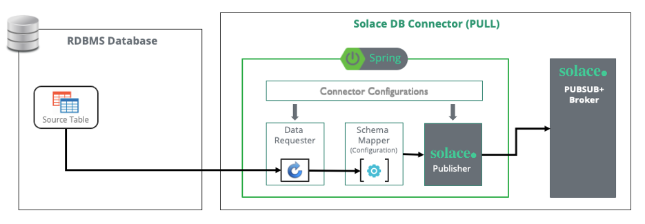
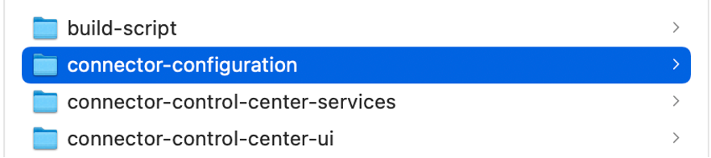
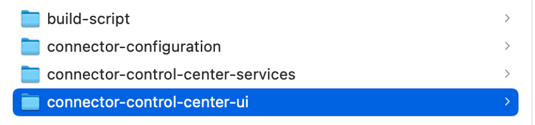
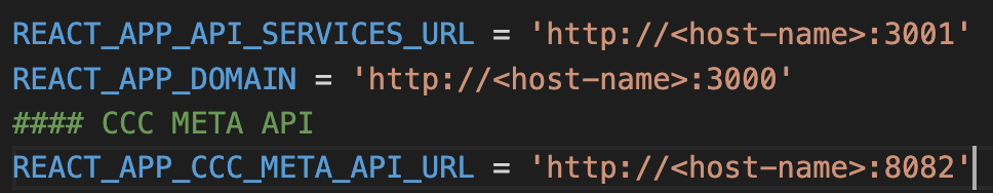
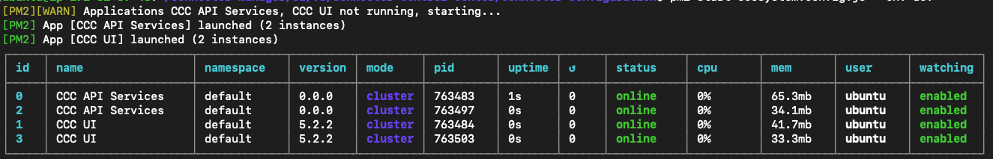

# Solace Pubsub Connector For Database Source 

 
## 1 Introduction

The **Solace Pubsub Connector For DB Source** has been built to make DB transactions participated in event mesh by using the Connector for DB Source

**Solace Pubsub Connector For DB Source** helps to read the database records and make it available as an event in the Solace Event Mesh for enterprise applications to consume.

Note: Pulls the records which are marked as unread.
 



### 1.1	Purpose

To guide the technical teams to setup the **Solace Pubsub Connector For DB Source**.

### 1.2.	Scope

Covering the step-by-step guide to setup the **Solace Pubsub Connector For DB Source**.

1.	Generate JPA Entities using the tool
2.	Configure DB Souce Connector
	a.	Connection Configuration (Database & Solace)
	b.	Connector & Entity Configuration
	c.	Schema Mapping (Table Structure to Solace Event Payload)

`Note: This document currently captures the deployment in Java environment.`

### 1.3	DB Connector Features

| S.No |	Feature |
| :---: | ---- |
|1	 |The source DB object from where Adapter polls remains as-is (as EMS).<br/>No change expected at application DB end (Includes Tables, Views & Child Table)|
|2	|Adapter should pick records in sequence only (Based on Sequence Number and timestamp field)|
|3 | The Adapter should be able to update each record with appropriate flag (in existing adb_l_delivery_status field) <br/> &emsp;&emsp;N - New : set by trigger <br/> &emsp;&emsp;P - Pending: under process (picked up by adapter, not yet published to messaging layer)  <br/> &emsp;&emsp;C - Completed: Processing completed (published successfully to messaging layer) <br/> &emsp;&emsp;F - Failed: Fail to publish record|
|4|	The adapter should have the capability to read in batch and update flag in batch to avoid chattiness and ensure better performance |
|5	|Oracle DB should be supported (12g onwards (19C and ADG and RAC)|
|6	|Design should be future proof for oracle version upgrades. Should support Thick and Thin DB driver|
|7	|Should support ADG URL|
|8|	Should have option to retry before marking record as 'F' The query to poll should be configurable.|
|9	|Schema mapping feature should be Forward compatible. |
|10	|Any new addition to DB schema should be ignored by Adapter unless Field name and mapping is provided.|
|11	|Option to specify the data type of each field in the mapping.|
|12|	Support for CLOB and BLOB|
|13|	Date format to be as per the TIBCO specs - Should be configurable. default is yyyy-MM-dd'T'HH:mm:ss.SSS  |
|14|	Logging & Syslog|
|15	|High Available & Fault Tolerance|
|16	|Event Headers: <br/>&emsp;&emsp; In Solace Message Header, for each message published, add Tracking Id coming from source table<br/>&emsp;&emsp; 	Time at which picked from DB <br/>&emsp;&emsp; 	Time of publish to Solace |

## 2	DB Connector Configuration
### 2.1.	Pre-requisites
*	JDK 1.8+
*	Solace 
*	Database for Oracle or MySQL

### 2.2.	Install Solace Framework and Transform Engine

Go to the Framework jar and pom files folder and run below command to install into your local maven repo:

```
mvn install:install-file -Dfile=pubsubplus-connector-framework-parent-1.0.0-SNAPSHOT.pom -DgroupId=com.solace.connector.core -DartifactId=pubsubplus-connector-framework-parent  -Dversion=1.0.0-SNAPSHOT  -DpomFile=pubsubplus-connector-framework-parent-1.0.0-SNAPSHOT.pom

mvn install:install-file -Dfile=pubsubplus-connector-io-common-1.0.0-SNAPSHOT.jar -DgroupId=com.solace.connector.core -DartifactId=pubsubplus-connector-io-common -Dversion=1.0.0-SNAPSHOT -DpomFile=pubsubplus-connector-io-common-1.0.0-SNAPSHOT.pom

mvn install:install-file -Dfile=pubsubplus-connector-framework-1.0.0-SNAPSHOT.jar -DgroupId=com.solace.connector.core -DartifactId=pubsubplus-connector-framework -Dversion=1.0.0-SNAPSHOT -DpomFile=pubsubplus-connector-framework-1.0.0-SNAPSHOT.pom

mvn install:install-file -Dfile=solace-transformation-engine-1.0.0-SNAPSHOT.jar -DgroupId=com.solace.connector.core -DartifactId=solace-transformation-engine  -Dversion=1.0.0-SNAPSHOT -DpomFile=solace-transformation-engine-1.0.0-SNAPSHOT.pom
```


### 2.3.	Solace Pubsub Connector For DB Source

Download the Solace DB connector (spring-cloud-stream-binder-db and pubsubplus-connector-database) and unzip to the location/machine where the connector is getting installed

Go to spring-cloud-stream-binder-db folder and run:

```
mvn -DskipTests=true install
```

Go to pubsubplus-connector-database folder and run:

```
mvn -DskipTests=true clean package
```

### 2.4	DB Configuration


**Cofiguration File**: `projConfig/application.yml`

```
solace-persistence:
  datasource:
    driver-class-name: oracle.jdbc.OracleDriver
    url: jdbc:oracle:thin:@//IP:Port/Instance
    username: username
    password: password
    hikari:
      initializationFailTimeout: -1
      connection-timeout: 5000
  jpa:
    hibernate:
      ddl-auto: none
    show-sql: false
    properties:
      hibernate:
        jdbc:
          batch_size: 100
        order_updates: true
        generate_statistics: false
        dialect: org.hibernate.dialect.Oracle10gDialect
    database: oracle
  source:
    sendBatchSize: 1 #records per message
    queryMax: 2 #limited records per DB query
    maxDbRetry: 3
    triggerInterval: 2000
    retryInterval: 10 # seconds
    enableRetry: true #enable retry to send the message to Solace.
    retryCount: 3
    enableBufferedJpaBatch: true # only available when sendBatchSize = 1
    bufferWaitSeconds: 5
    enableTrackingId: true #update tracking Id to table

    enableDatabaseTimestamp: true
    enableConnectorTimestamp: true
    enableBenchmarkInfo: true

```

* Fill in all the required details of `solace-persistence.datasource` to establish a connection with Database.

* `solace-persistence.datasource` section, `batch_size`: Given batch size will allow connector to update the status back to Database in a batch mode


* `solace-persistence.datasource.hikari` section, Hikari Settings: Will enable connector to perform retry/reconnect until it is timeout.

           
* `solace-persistence.source` section, Additional configurations to pull the data from Database.


### 2.5	Solace Configuration

**Configuration File**: `projConfig/application.yml`

```
spring:
  cloud:
    stream:
      bindings:
        input-0:
          destination: souceBinderLVQ      #LVQ queue name
          binder: solace-db                #Solacedatabase binder
          group: no
        output-0:
          destination: dxb/passenger     #topic to send data
          binder: solace
          content-type: application/x-java-serialized-object

```

* `spring.cloud.stream.bindings.input-0` section, Fill in all the required details to establish a connection with Solace
* `spring.cloud.stream.bindings.output-0` section, Set contentType to application/x-java-serialized-object to send plain text message, the default is bytes.


Configure the management part for the HA:

```
solace:
  connector:
    workflows: # Workflow configuration
      0:
        enabled: true  # If true, the workflow is enabled.
        acknowledgment:
          publish-async: true
        transformation:
          mappingFile: ""
          mode: customentitytoxml
    #      1:
    #        enabled: false  # If true, the workflow is enabled.
    #        acknowledgment:
    #          publish-async: true
    management:
      leader-election:
        mode: active_standby  # The connector’s leader election mode. (values: standalone, active_active, active_standby)
        fail-over:
          max-attempts: 3  # The maximum number of attempts to perform a fail-over.
          back-off-initial-interval: 1000  # The initial interval (milliseconds) to back-off when retrying a fail-over.
          back-off-max-interval: 10000  # The maximum interval (milliseconds) to back-off when retrying a fail-over.
          back-off-multiplier: 2.0  # The multiplier to apply to the back-off interval between each retry of a fail-over.
      queue: management-queue-push  # The management queue name.
      session: # The management session. This has the same interface as that used by `solace.java.*`. For more info: https://github.com/SolaceProducts/solace-spring-boot/tree/master/solace-spring-boot-starters/solace-java-spring-boot-starter#updating-your-application-properties
        host: tcp://ManagementSolaceIP:Port
        msgVpn: default
        client-username: username
        client-password: password
  java:
    host: tcp://DataSoalceIP:Port
    msgVpn: default
    clientUsername: username
    clientPassword: password
    connectRetries: -1
    reconnectRetries: -1
    apiProperties:
      pub_ack_window_size: 50
      pub_ack_time: 200


```

### 2.6.	Config file and mapper file
**Configuration File**: `connector_config.properties`:

```
#table entity mapping
source_passenger=com.solace.connectors.database.source.entity.SourcePassenger
passAddress=com.solace.connectors.database.source.entity.PassAddress

DB_TABLE=source_passenger
#--------------------source_passenger--------------

#use default output-0
source_passenger.BINDING=output-0
#data topic name, send the event of record to this topic
source_passenger.TOPIC=dxb/source_passenger
#lvq topic name, send checkpoint data to this topic
source_passenger.LVQ_TOPIC=lvq/source_passenger
#parent table name
source_passenger.DB_TABLE=source_passenger
#key column property in the parent table, have relationship with child table key.
source_passenger.DB_PARENT_KEY=passengerId
#map in the main entity.
source_passenger.DB_PARENT_COLLECTION=addresses
#child table name
source_passenger.DB_CHILD_TABLE=passAddress
#key column property in the child table, relationship with parent table key
source_passenger.DB_CHILD_KEY=passId
#source table read indicator column
source_passenger.DB_READ_INDICATOR_COLUMN=flag
#specify the tracking ID column property
source_passenger.DB_TRACKING_ID=dbtrackid
#specify the read time column property, update this column with the reading record time by connector
source_passenger.DB_READ_TIME=readtime
# status of the indicator column value.
source_passenger.DB_READ_INDICATOR_COLUMN_UPDATE_VALUE_INPROGRESS=p
source_passenger.DB_READ_INDICATOR_COLUMN_UPDATE_VALUE_PROCESSED=c
source_passenger.DB_READ_INDICATOR_COLUMN_DEFAULT_VALUE=n
source_passenger.DB_READ_INDICATOR_COLUMN_FAILED_VALUE=f
# sequeial column property
source_passenger.DB_READ_RECORD_SEQUENTIAL_INDICATOR=id.passengerId
# order by, asc or desc
source_passenger.DB_READ_RECORD_SEQUENTIAL_ORDER=asc
#if true, it will read the failed ones after starting the connector, if failed, it will ignore the failed one.
source_passenger.DB_READ_INDICATOR_BRIDGE_FAILED_VALUE=true
##message heasers
source_passenger.MESSAGE_HEADER_TRACK_ID=dbtrackid
#MESSAGE_HEADER_CREATE_TIME=createTime

```


Create mapper files for source_<table_name>_trgt_schema_mapper.yml for each table, ex
`source_passenger_trgt_schema_mapper.yml`

```
solace-connector-mapper:
  mapper-metadata:
    escape-special-characters: true
    schema-type:
    encrypted:
  payload-mapper:
    mapper-name0:
      source-xpath: source_passenger/passengerId
      source-datatype:
      target-xpath: passenger/id
      target-datatype:
    mapper-name1:
      source-xpath: source_passenger/name
      source-datatype:
      target-xpath: passenger/pname
      target-datatype:
    mapper-name2:
      source-xpath: source_passenger/birthday
      source-datatype:
      target-xpath: passenger/birthday
      target-datatype:
    mapper-name3:
      source-xpath: source_passenger/passAddress/city
      source-datatype:
      target-xpath: passenger/addresses/passAddress/city
      target-datatype:


```


### 2.7 Connector Logging
        
Logback has been used to enable the logging mechanism. 

**Configuration File**: `resources/logback.xml`

You can change your log default folder in logback.xml:

```
<property name="LOG_HOME" value="log/pull-connector/"/>
```
   
You can change your log level as showed below:

```
<!--DEBUG,INFO,WARN,ERROR,FATAL-->
<root level="INFO">
    <appender-ref ref="STDOUT"/>
    <appender-ref ref="FILE"/>
    <appender-ref ref="RSYSLOG" />
</root>

```


### 2.8	Admin client configuration
Please configure  the admin sever as follows in application.yml

```yml
spring:
  boot:
    admin:
      client:
        enabled: true
        url: http://localhost:8082       #configure your admin server url
        auto-registration: true
  application:
    name: Instance006                    #configure your application name

```


## 3	Generate Entity tool.

Hibernate API’s has been used to generate the JPA entities and load into the connector code. This will reduce the manual efforts to write the entity file for all the tables.

`Note: We are also finding a way to automate the entire entity generation process to reduce the manual interventions.`

Download the generateEntity project and edit the below show file to generate the entities on the connected schema.

`pom.xml` configuration

```xml
<configuration>
    <!--      <templatePath>${project.basedir}/src/main/resources/jpagen/tempalate/</templatePath>-->
    <!-- Defaults: -->
    <outputDirectory>${project.basedir}/src/main/java/</outputDirectory>
    <!—hibernate configuration file-->
    <propertyFile>src/main/resources/hibernate.properties</propertyFile>
    <!—DB and Entity data type mapping configuration file-->
    <revengFile>src/main/resources/reveng.xml</revengFile>
    <!--entity operation info -->
    <revengStrategy></revengStrategy>
    <packageName>com.solace.connector.db.pull.entity</packageName>
    <detectManyToMany>true</detectManyToMany>
    <detectOneToOne>true</detectOneToOne>
    <detectOptimisticLock>true</detectOptimisticLock>
    <createCollectionForForeignKey>true</createCollectionForForeignKey>
    <createManyToOneForForeignKey>true</createManyToOneForForeignKey>
    <!-- true JPA anotation -->
    <ejb3>true</ejb3>
    <jdk5>true</jdk5>
</configuration>

```


DB configuration
        The file `hibernate.properties` location is configured in pom.xml file:

```
default_schema=TEST
hibernate.connection.driver_class=oracle.jdbc.driver.OracleDriver
hibernate.connection.username=system
hibernate.connection.password=oracle
hibernate.connection.url=jdbc:oracle:thin:@localhost:47161/xe
hibernate.dialect=org.hibernate.dialect.Oracle10gDialect

```


Data type mapping configuration
The file `reveng.xml` location is configured in pom.xml file:

```

<sql-type jdbc-type="DATE" hibernate-type="java.util.Date"/>
    <sql-type jdbc-type="TIMESTAMP" hibernate-type="java.util.Date"/>
    <sql-type jdbc-type="DECIMAL" hibernate-type="java.lang.Double" />
    <sql-type jdbc-type="FLOAT"   hibernate-type="java.math.BigDecimal" />
    <sql-type jdbc-type="NUMERIC"  hibernate-type="java.math.BigDecimal" />
    <sql-type jdbc-type="BLOB"   hibernate-type="java.lang.Byte[]" />
    <sql-type jdbc-type="CLOB"   hibernate-type="java.lang.String" />

```


Note: 

* match-name could be a single table name, or it can be a wildcard string (.*) to generate the entity.
* Some of the minute modifications needed to fit to DB Connector entity requirements
* Also, no modification to single table entity, this is only for parent/child table.
* Add tablename to generate a single table 

```
 <table-filter match-schema=".*" match-name="tablename"/>
```

**Parent table** ex:

```java
##Below are generated by tool, should be removed:

@OneToMany(fetch=FetchType.LAZY, mappedBy="sourcePassenger")
private Set<PassAddress> passAddresses = new HashSet<PassAddress>(0);
Set<PassAddress> passAddresses
Set<PassAddress> getPassAddresses()
Set<PassAddress> passAddresses

Replace all the Set<> to be List<Map> in the entity:
private List<Map> addresses;
@JsonIgnore
@Transient
public List<Map> getAddresses() {
    return addresses;}
public void setAddresses(List<Map> addresses) {
    this.addresses = addresses;}

```


The `addresses` is the `DB_PARENT_COLLECTION `of `connector_config.properties` .

If there is no PK for parent table.
2 entities are generated for parent table, `entity` and `entityId`. 

Move all the properties/methods from entityId to entity.

In the entity, remove  `@AttributeOverrides({})`.

For example: Parent table entity:     `SourcePassenger`  Parent table entityId:   `SourcePassengerId`

Move all the property in SourcePassengerId to SourcePassenger, and remove `@AttributeOverrides({})` in SourcePassenger and add below:


Add `@Id` on the unique column of `SourcePassenger`:

```java
@Id
@Column(name="PASSENGER_ID", nullable=false, precision=10, scale=0)

```


**Child table** ex:

If there is no PK for child table.
2 entities are generated for child table, `entity` and `entityId`. Move all the properties/methods from entityId to entity .

In the entity, remove  `@AttributeOverrides({})`.

For example: Child table entity: `PassAddress` Child table entityId: `PassAddressId`
Move all the properties in PassAddressId to PassAddress.
Add @Id on the unique column of PassAddressId:

```java
@Id
@Column(name="ID", nullable=false, precision=10, scale=0)
```


**Create VIEW entity** :

When it is a VIEW object in DB, please treat it as a single table, just point your table name to your view name.

For example, if you have a view `Customer`. 2 entities will be generated, `Customer` and `CustomerId`, please move all properties from CustomerId to Customer.
In the entity, remove  `@AttributeOverrides({})`.
Add `@Id` on the unique column of `Customer`:

```
@Id
@Column(name="CUSTOMER_ID", nullable=false, precision=10, scale=0)
```


Command to run:

```
mvn hibernate-tools:hbm2java
```


## 4	Run Connector

### 4.1	Command line to run the Solace Pubsub Connector For DB source
Go the project 

```
mvn clean package
```

Go to target folder and run as standalone mode:

```
java -cp ./pubsubplus-connector-database-1.0.0-SNAPSHOT.jar  org.springframework.boot.loader.PropertiesLauncher --spring.config.additional-location="./ classes/source-config/" -server.port=8081
```


### 4.2	Command line to run the Solace Pubsub Connectors as HA
Please specify server.port to another value that is not used.

```
java -cp ./pubsubplus-connector-database-1.0.0-SNAPSHOT.jar  org.springframework.boot.loader.PropertiesLauncher --spring.config.additional-location="./ classes/source-config /"  -server.port=8082
```

Please refer to 1.4.2 Solace Configuration> Configure the management part for the HA.


## 5	Connector Monitoring

Connector monitoring is a Spring Boot Admin server which helps to visualize the connectors deployed in the organization

### 5.1	Prerequisites
*	Maven 3
*	JDK 17

### 5.2	Infrastructure Requirement


| Component Name |	Cores	| RAM (GB) |Runtime |
|----|----|----|----|
|Spring Boot Admin |	2 |	4 |	Java |

## 6	Connector Management

*	Connector management is a UI based tool to generate the code binary based on the configuration provided in the tool.
*	All the connector configurations will be stored in the database attached to the CM
*	Will allow to edit the configuration for the available connectors in the CM database.

### 6.1	Architecture


### 6.2	Pre-Requisites


| S.No |	Runtime	| Version | Description |
|----|:----:|:----:|----|
| 1| 	NodeJS|V12| 	Used for CM runtime
| 2	| NPM	| V6	| Used to manage node packages required by CM
| 3	| PM2	| 5.2	| Used to manage NodeJS process for scalabilty
| 4	| Java	| 17	| Used for Database Meta API runtime
| 5	| Oracle Instant Client| 	21	| Required for NodeJS library to initiate connection with Oracle
| 6| 	Maven	| 3 	| Used to Manage dependencies required by Meta API


### 6.3	Infrastructure Requirement

Solace Connector Management will be deployed in a single VM


| Component Name |	Cores	| RAM (GB) |Runtime |
|----|:----:|:----:|----|
|Connector Management (UI+Services)|	4	| 6 |NodeJS|
|DB Meta API (Per Schema) |	1|	2	|Java|


### 6.4	Connector Management Installation Guide

CM Deployment kit contains:

*	Schema script (Oracle) 
	*	This script includes all the required database commands to create tables required for Connector Management
*	Spring Admin Server Binary
	*	This binary spins ups the Spring Admin server after providing required configurations
*	CM NodeJS Binary
	*	User interface component which can be used to configure/manage connectors.


Database preparation

*	Create Schema: `connector_control_schema`
*	Create the tables: Execute the Schema Script provided in the kit to create the required tables.

Deploy CM:

*	Unzip the file <file-name> to the desired location
*	Edit the ecosystem.config.js file located in `connector_configuration` folder. This configuration is used by PM2




The same configuration can be repeated for different environments like dev, qa, prod.

Edit the `.env` file in the UI folder `connector-control-center-ui`





Run the script located in `build-script` folder in the kit to create the build.


Command to execute the script 

```
 cc_deploy.sh
```

Once successfully executed the script navigate to connector-configuration folder and execute the below command

```
pm2 start ecosystem.config.js –env <dev,qa,prod>
```

To validate, run `pm2 ls` and you should see the following services up and running.



### 6.5.	Connector Generation Guide

Generating the connector binary is a three-step process

1. Add schema to CM

1. Generate entity (JPA Notation) for the schema
 
1. Generate connector configurations as per the selected schema tables to bridge the data to Solace as events  

### 6.6.	Add Schema

### 6.7.	Generate Entity

### 6.8.	Generate Connector Configurations


## 7	Connector Config Parameters
### 7.1.	Connector parameters


<table>
    <tr>
        <th>Config Type	</th><th>Config Location</th><th>	Parameter (Hierarchy)</th><th>	Description</th>
    </tr>
	<tr>
        <td rowspan="15">Generic-DB</td>
        <td rowspan="15">application.yml</td>
        <td>solace-persistence:datasource:driver-class-name</td>
        <td rowspan="4">DB Connection Details</td>
    </tr>
    <tr>
        <td>solace-persistence:datasource:url</td>
    </tr>
    <tr>
        <td>solace-persistence:datasource: username</td>
    </tr>
    <tr>
        <td>solace-persistence:datasource: password</td>
    </tr>
	<tr>
        <td>solace-persistence:datasource:hikari:minimum-idle</td>
        <td rowspan="5">Config the connection pool for DB</td>
    </tr>
    <tr>
        <td>solace-persistence:datasource:hikari:idle-timeout</td>
    </tr>
    <tr>
        <td>solace-persistence:datasource:hikari:maximum-pool-size</td>
    </tr>
    <tr>
        <td>solace-persistence:datasource:hikari:max-lifetime</td>
    </tr>
    <tr>
        <td>solace-persistence:datasource:hikari:connection-timeout</td>
    </tr>
    <tr>
        <td>solace-persistence:jpa:hibernate:ddl-auto</td>
        <td>hibernate property, recommended to use none in production</td>
    </tr>
	<tr>
        <td>solace-persistence:jpa:show-sql</td>
        <td>True, will print the queries in the logs</td>
    </tr>
    <tr>
        <td>solace-persistence:jpa:database</td>
        <td>Type of the target database ex: mysql,oracle</td>
    </tr>
    <tr>
        <td>solace-persistence:jpa:properties:jdbc:batch_size</td>
        <td>The size of jpa batch opration</td>
    </tr>
    <tr>
        <td>spring:cloud:function:stream:poller:fixed-delay</td>
        <td>Defines the interval frequency of the data polling from Database</td>
    </tr>
	<tr>
        <td>spring:cloud:function:stream:bindings:dataCollectting-out-0:destination</td>
        <td>Allowed to configure both static and dynamic topics <br/>Some of the parameterized notations will add data to topic during the runtime.<br/>
        {COL:column name}: adds the value for defined column name into the to the topic<br/>
{DB_TABLE}: adds a table name to the topics based on connector_config.properties file<br/>
Ex: DXB/{COL:passengerId}/{COL:name}/SGP/{DB_Table}
        </td>
    </tr>
	<tr>
        <td rowspan="1">logging</td>
        <td rowspan="1">logback.xml</td>
        <td>&lt;root level="INFO"&gt;<br/>
    &emsp;&emsp;&lt;appender-ref ref="STDOUT"/&gt;<br/>
    &emsp;&emsp;&lt;appender-ref ref="FILE"/&gt;<br/>
    &emsp;&emsp;&lt;appender-ref ref="RSYSLOG" /&gt;<br/>
    &lt;/root&gt;
		</td>
        <td rowspan="1">used logback to config logging,  it has different levels:
DEBUG,INFO,WARN,ERROR,FATAL</td>
    </tr>
        <tr>
        <td rowspan="14"> Source property</td>
        <td rowspan="14">application.yml</td>
        <td>solace-persistence:source:jpaBatchMode</td>
        <td rowspan="1">Allow to merge multiple records into a single event</td>
    </tr>
    <tr>
        <td>solace-persistence:source:queryMax</td>
        <td>Set the max records for each query read from database</td>
    </tr>
    <tr>
        <td>solace-persistence:source:maxDbRetry</td>
        <td>it will do retry to connect the db</td>
    </tr>
    <tr>
        <td>solace-persistence:source:enableRetry</td>
        <td>If true, it will retry query to db</td>
    </tr>
    <tr>
        <td>solace-persistence:source:retryInterval</td>
        <td>Messages resent to Solace in the defined interval</td>
    </tr>
    <tr>
        <td>solace-persistence:source:retryCount</td>
        <td>Max retry count and mark the record as a failure attempt</td>
    </tr>
    <tr>
        <td>solace-persistence:source:enableBufferedJpaBatch</td>
        <td>if true, connector will write back indicator values in batch mode</td>
    </tr>
	<tr>
        <td>solace-persistence:source:bufferWaitSeconds</td>
        <td>timeout for getting ack from Solace</td>
    </tr>
    <tr>
        <td>solace-persistence:source:enableRetry</td>
        <td>True,  to enable resend the message to Solace</td>
    </tr>
    <tr>
        <td>solace-persistence:source:retryCount</td>
        <td>When enableRetry is true, retry numbers to the Solace.</td>
    </tr>
    <tr>
        <td>solace-persistence:source:enableBufferedJpaBatch</td>
        <td>True to enable batch update to the DB</td>
    </tr>
    <tr>
        <td>solace-persistence:source:bufferWaitSeconds</td>
        <td>Interval between batch update to the DB</td>
    </tr>
    <tr>
        <td>solace-persistence:source:enableTrackingId<br/> solace-persistence:source:enableDatabaseTimestamp<br/>
solace-persistence:source:enableConnectorTimestamp</td>
        <td>True, to enable message header contain those info.</td>
    </tr>
	 <tr>
        <td>solace-persistence:source:enableBenchmarkInfo</td>
        <td>True, to print performance detail log</td>
    </tr>    
	<tr>
        <td rowspan="3">Admin Client</td>
        <td rowspan="3">application.yml</td>
                <td>sping.boot.admin.client.enable:true</td>
        <td>True to enable.</td>
    </tr>
    <tr>
        <td>sping.boot.admin.client.enable:url</td>
        <td>Set the admin server url</td>
    </tr>
    <tr>
        <td>sping.boot.application.name</td>
        <td>Name of the application</td>
    </tr>
	<tr>
        <td rowspan="3">Solace</td>
        <td rowspan="3">application.yml</td>
         <td>sping.cloud.stream.binding.input-0.destination</td>
        <td>LVQ queue name</td>
    </tr>
    <tr>
        <td>sping.cloud.stream.binding.output-0.destination</td>
        <td>LVQ topic name</td>
    </tr>
    <tr>
        <td>sping.cloud.stream.binding.output-0.content-type</td>
        <td>Message content typ: plain text is application/x-java-serialized-object </td>
    </tr>
</table>


### 7.2	File Naming Convention

|File Type	|Naming Convention	|Description| Note |
|---|----|----|----|
|Spring Application	|application.yml	|A standard spring boot configuration|	Follow the sring standard yaml notations|
|Connector for DB source(Config)	|connnector_config.properties|	Solace DB Connector Configuration file|Generated |
|Connector For DB souce(Mapper File)|	<DB_TABLE>_trgt_schema_mapper.properties|	A mapper file which will have the mapping definition between the parent table Schema to the target event payload schema	|DB_TABLE value can be identified from connector_config.properties file. <br/> All the field mappings should follow the xpath format|
|Connector for DB source(Mapper File)	|<child table>_trgt_schema_mapper.properties|	A mapper file which will have the mapping definition between the parent table Schema to the target event payload schema|	Generated |
 


